  

  

  

  

---
 

  

---
 
### 🚀 Projects
 
| Project | What it is |
|---|---|
| [**NLP Transformers**](https://github.com/Mycodelab-lab/NLP-internship) | Question answering, summarization, NER |
| [**Quantum ML**](https://github.com/Mycodelab-lab/QIntern-Project) | Quantum machine learning experiments |
| [**StudyBuddy**](https://github.com/Mycodelab-lab/StudyBuddy) | Python study assistant |
 
---
 
### 🐍 Snake
 

  

 
